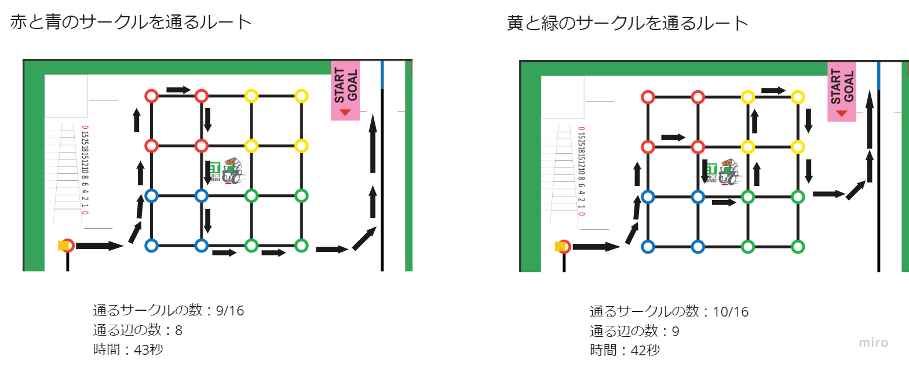

# README
## はじめに
### 目指す目標について
* 最低限1個のブロックを持っていくことを目指します。
* 2つの走行ルートのうち目視でルートを選んでスタートアクションなどで変更してください。  
※詳細は走行ルートの章で説明。


### モジュール化方針(実装方法)
1. タスクの定義
* `app.cfg`  
札幌で定義しているタスク
```
CRE_TSK(CARRY_BLOCK_TASK, { TA_NULL, 0, carry_block_task, CARRY_BLOCK_PRIORITY, STACK_SIZE, NULL });
CRE_TSK(TRACER_TASK, { TA_NULL, 2, tracer_task_sapporo, TRACER_PRIORITY, STACK_SIZE, NULL });
CRE_TSK(COLOR_CHECK_TASK, { TA_NULL, 0, color_check_task, COLOR_CHECK_PRIORITY, STACK_SIZE, NULL });
CRE_TSK(TSK_LCL,{ TA_NULL, 0, localizer_task, LOCALIZER_PRIORITY, STACK_SIZE, NULL });
CRE_CYC(CYC_TRACER, { TA_NULL, { TNFY_ACTTSK, TRACER_TASK }, 10U * 1000U, 1U * 1000U });
CRE_CYC(CYC_COLOR_CHECK, { TA_NULL, { TNFY_ACTTSK, COLOR_CHECK_TASK }, 10U * 1000U, 1U * 1000U });
CRE_CYC(LCL_CYC,{ TA_NULL, { TNFY_ACTTSK, TSK_LCL}, 10 * 1000U, 1U * 1000U });

ATT_MOD("LineTracerService.o");
ATT_MOD("ColorCheckService.o");
ATT_MOD("ColorLogic.o");
ATT_MOD("Sapporo.o");
```

* `Makefile.inc`  
cファイルからc++ファイルに書き換える
```

```

2. 停止すべきもの,影響があるものがあれば書く


3. 終了条件用の周期タスクを起動  
`sta_cyc(CYC_COLOR_CHECK);`  
`sta_cyc(LCL_CYC);`

4. メソッド呼び出し  
* 初期化する  
`user_system_create(int cose);`  
int cose: 走行するコース  
赤と青なら1、黄と緑なら2

* ブロック運びタスク起動  
`act_tsk(CARRY_BLOCK_TASK);`  
`slp_tsk();`

5. オブジェクト削除(ゴールまで行ければそれでよいなら不要)  
`user_system_destroy();`

### 走行ルート
目視で与える引数を変える  
優先度1: できるだけ多くのブロックを通るコース(12点)  
優先度2：最初に通るブロックをつかむので赤ブロックが走行ルートの手前にあるコース(6点or2点)  



例)スタート動作で押すボタンを変更する
* 右ボタンでスタートするなら赤と青→`user_system_create(1);`
* 左ボタンでスタートするなら黄と緑→`user_system_create(2);`


※手前の青ブロックについて  
ここにブロックがあった場合は運搬はできません。しかし、移動が50％くらいで可能なので、得点の見込みはあります。ご了承ください。

### 走行体差によって調整が必要なパラメータ
走行体差によって、調整する必要があります。失敗するケースによって`/Block/controller/Sapporo.cpp`の以下の変数を調整してください  
* ブロックエリアまでの移動で失敗する場合  
`#define END_LCL_NO_LINE         (60)`  
`#define END_LCL_NO_LINE_CENTER  (150)`  
`#define FIRST_ANGLE             (44)`  
* 90度旋回で失敗する場合  
`#define RIGHT_ANGLE             (45) `  
* ジグザグする直線で失敗する場合  
`#define ZIG                 (10)`  
`#define ZAG                 (13)`  
* 色の検知で失敗する場合  
`#define COLOR_CHECK_NUM     (2)`→検知が遅れる場合は下げる、誤検知する場合は上げる  
* ライントレースが失敗する場合  
`#define BASE_SPEED          (48)`  
`#define LOW                 (45)`  


### ログについて
基本的にはコメントアウトしています。初期化と、今のシーンが何かだけ出力しています。  
※札幌では走行動作と終了条件などをシーンという区切りとして、シーンの組み合わせで動作させています。
